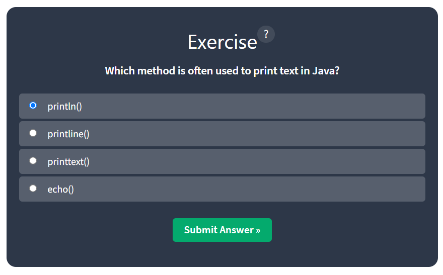
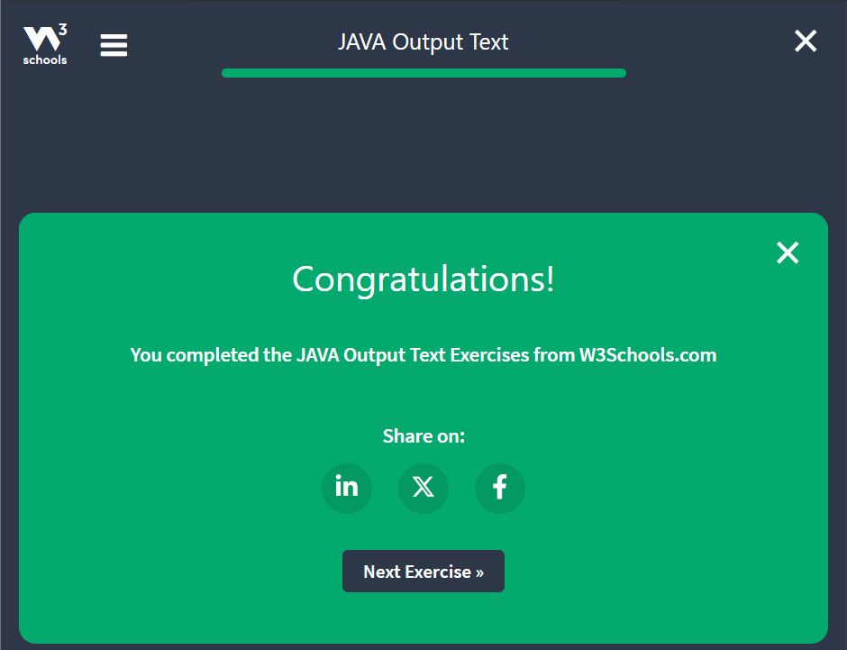

# Java Week 1 notes

- Java is a popular programming language, created in 1995.
- It is owned by Oracle, and more than 3 billion devices run java 
- It is used for:
  - Mobile applications ( specifically Android apps )
  - Desktop applications
  - Web applications
  - Web Servers and application servers
  - Games
  - Databases Connection
  - And much, much more!

## Why Use Java?
- Java works on different platforms (Windows, Mac, Linux, Raspberry Pi, etc.)
- It is one of the most popular programming languages in the world
- It has a large demand in the current job market.
- It is easy to learn and simple to use.
- It is open-source and free.
- It is secure, fast and powerful.
- It has a huge community support (tens of millions of developers)
- Java is an Object oriented language which gives a clear structure to programs and allows code to be reused, lowering development costs.
- As Java is close to C++ and C#, it makes it easy for programmers to switch to java or vice versa.

## Getting Started
- Created account in w3 school and went to "Learn Java".
- Installed Intellij-Community Edition and installed java JRE
- Checking javac -version and found to be 23.0.2


## Java Quickstart
- In Java, every application begins with a class name, and that **class** must **match** the **filename.**
- Here, we are creating our first java file, which will be called **Main.java**
- This file will contain "Hello World" message, which is written with the following code:
```java
public class Main {
    public static void main(String[] args) {
        System.out.println("Hello World");
    }
}
```


- Then, we saved the file, and navigated to the directory and compiled the code:
```commandline
javac Main.java
ls
```


- After compiling the code, there were no errors, and run the file with this command in terminal:
```commandline
java Main
```


And, this is how we executed the first Java program.

## Java Syntax
So, in the previous sections:
- we created a Java file called "Main.java"
- we used the following code to print "Hello World" to the screen
```java
public class Main {
    public static void main(String[] args) {
        System.out.println("Hello World");
    }
}
```

### Example Explained
Every line of code that runs in Java must be inside a ``class``.
And, the class name should always start with an uppercase first letter.
In our example, we named the class **Main**.

**Note:** Java is case-sensitive: "MyClass" and "myclass" has different meaning.

The name of the java file **must match** the class name. When saving the file, saving it using the class Name, and add ".java" to the end of the filename.
To tun the example, we compiled it and ran it.

### The ``main`` Method
The ``main()`` method is required and we see it in every Java program:
```java
public static void main(String[] args){}
```

- Any code inside the ``main()`` method will be executed.
- We don't have to worry about the keywords before and after it. We will get to know them bit by bit while reading the tutorial.
- For now, every Java program has a ``class`` name which must match the filename, and that every program must contain the ``main()`` method.

### ``System.out.println()``
Inside the ``main()`` method, we can use ``println()`` method to print a line of text to the screen:
```java
public static void main(String[] args) {
    System.out.println("Hello World");
}
```

**Note:** the curly braces ``{}`` marks the beginning and the end of a block of code.

- ``System`` is a built-in Java class that contains useful members, such as ``out``, which is short for "output".
- The ``println()`` method, short for "print line", is used to print a value to the screen (or a file).
- We should not worry much about how ``System``, ``out`` and ``println()`` works. We just should know that we need them together to print the stuff to the screen.
- We should note that each code statement must end with a semicolon (;).

### Java Syntax Exercises
#### A file containing a class called MyClass should be saved as:


#### Java is case-sensitive: 'MyClass' and 'myclass' has different meaning.


#### Insert the missing part of the code below to output "Hello World".


#### In Java, each code statement must end with a semicolon (;).

#### Exercise Completed


## Java Comments
Comments can be used to explain Java code, and to make it more readable.
It can also be used to prevent execution when testing alternative code.

### Single-line Comments
- Single-line comments start with two forward slashes (//).
- Any text between ``//`` and the end of the line is ignored by Java (will not be executed).
```java
// This is a comment
System.out.println("Hello World");
```
- This example uses a single-line comment at the end of a line of code
```java
System.out.println("Hello World"); // This is a comment.
```

### Java Multi-line Comments
- Multi-line comments start with ``/*`` and ends with ``*/``.
- Any text between ``/*`` and ``*/`` will be ignored by Java.
```java
/* This code will print the hello world
        and but class should be declared first and then other things.
 */
System.out.println("Hello World");
```
### Java Comment Exercises
#### What is the meaning of comments in Java?


#### Comments in Java are written with special characters. Insert the missing parts:


#### When do we usually use multi-line comments?

#### Exercise Completed


## Java Output/Print

### Print Text
We learned from the previous chapter that we can use the ``println()`` method to output values or print text in java;
```
System.out.println("Hello World!");
```

We can add as many ``println()`` methods as we want. Note that it will add a new line for each method:

```
System.out.println("Hello World!");
System.out.println("I am learning Java.");
System.out.println("It is awesome!");
```

#### After compiling the code and running it:


### Double quotes
- Text must be wrapped inside double quotations marks ``""``.
```java
System.out.println("This sentence will work!");
```
- While this will result in error:
```java
System.out.println(This sentence will produce an error);
```

### The ``Print()`` Method
- There is also a ``print()`` method, which is similar to ``println()``.
- The only difference is that it does not insert a new line at the end of the output:
```java
System.out.print("Hello World!");
System.out.print("I will print on the same line.");
```

### Java Output/Print Exercise
#### Which method is often used to print text in Java?


#### Text inside println() must be wrapped inside double quotes.


#### The difference between println() and print() is that:

#### Exercise Completed


## Java Output Numbers
### Print Numbers
We can also use the ``println()`` method to print the numbers.
```java
System.out.println(3);
System.out.println(38);
System.out.println(49003);
```

We can also perform mathematical calculations inside the ``println()`` method:
```java
System.out.println(5 + 3);
```

```java
System.out.println(2 * 5);
```

### Java Output Numbers Exercise
#### What is the output of the following code? ``System.out.println(3 + 3);``


#### Numbers inside println() must be wrapped inside double quotes. True or False


#### What is the output of the following code? ``System.out.println(2 * 5);``

#### Exercise Completed


