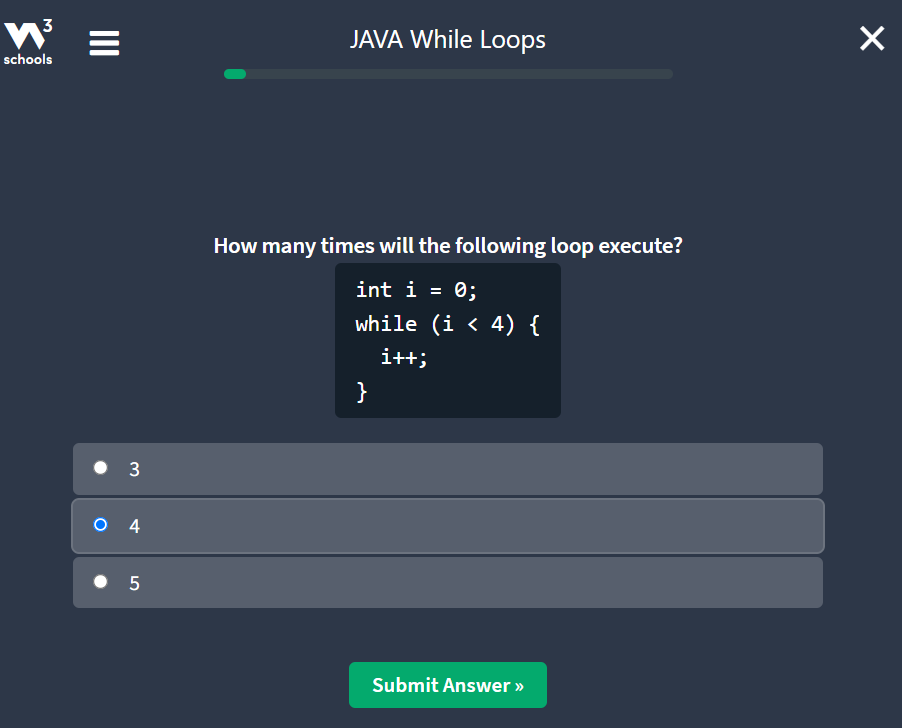

# Week 3 Assignment Notes

## Java Switch
### Java Switch Statements
- Instead of writing many ``if..else`` statements, we can use the ``switch`` statement.
- The ``switch`` statement selects one of many code blocks to be executed:

```java
switch(expression) {
    case x:
        // code block
        break;
    case y:
        // code block
        break;
    default:
        // code block
}
```
### How java switch works:
- The ``switch`` expression is evaluated once.
- The value of the expression is compared with the values of each ``case``.
- If there is a match, the associated block of code is executed.
- The ``break`` and ``default`` keywords are optional.

For example,

```java
int day = 5;
switch (day) {
  case 1:
    System.out.println("Monday");
    break;
  case 2:
    System.out.println("Tuesday");
    break;
  case 3:
    System.out.println("Wednesday");
    break;
  case 4:
    System.out.println("Thursday");
    break;
  case 5:
    System.out.println("Friday");
    break;
  case 6:
    System.out.println("Saturday");
    break;
  case 7:
    System.out.println("Sunday");
    break;
}
// output will be "Friday"
```
### Why do break keyword is used?
- when Java reaches a ``break`` keyword, it breaks out of the switch block.
- This stops the execution of more code, and case testing inside the block.
- When a match is found, and the job is done, it's time for a break. There is no need for more testing.

### The default Keyword
- The ``default`` keyword specifies some code to run if there is no case match:
```java
int day = 3;
switch (day) {
        case 6:
            System.out.println("Today is Saturday");
            break;
        case 7:
            System.out.println("Today is Sunday");
            break;
        default:
            System.out.println("Looking forward to the Weekend");
}
// Outputs "Looking forward to the weekend"
```

### Java Switch Exercise
#### Question 1


#### Question 2


#### Question 3

#### Exercise Completed


## Java While Loops
### Loops
- Loops can execute a block of code as long as a specified condition is reached.
- Loops are handy because they save time, reduce errors, and they make code more readable
### While Loop
- The ``while`` loop loops through a block of code as long as a specified condition is ``true``:
```java
while(condition) {
    // code block to be executed
        }
```
#### Example
```java
// below code in the loop will run, over and over again as long as variable i is less than 5
int i = 0;
while (i < 5) {
    System.out.println(i);
    i++;
        }
```
### While loop Exercises
#### Question 1


#### Question 2


#### Question 3

#### Exercise Completed


## Java Do/While Loop
### The Do/While Loop
- The ``do/while`` loop is variant of the ``while`` loop.
- The loop will execute the code block once, before checking if the condition is true, then it will repeat the loop as long as the condition is true.

```java
do {
    //code block to be executed
}
while (condition);
```
#### Example
```java
// here the loop will be executed at least once and then it will loop until the condition is false
int i = 0;
do {
    System.out.println(i);
    i++;
}
while (i < 5);
```
### Do/While Exercises
#### Question 1


#### Question 2


#### Question 3

#### Exercise Completed
