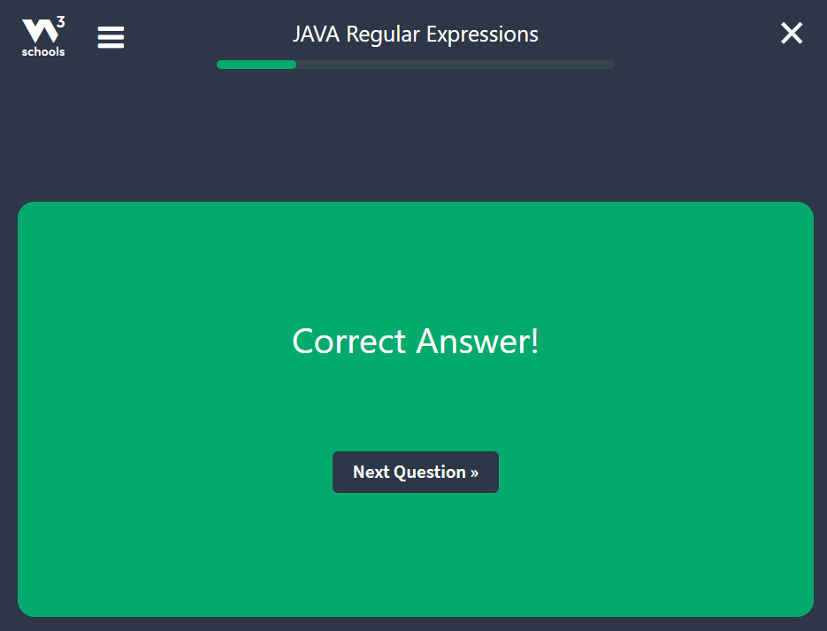
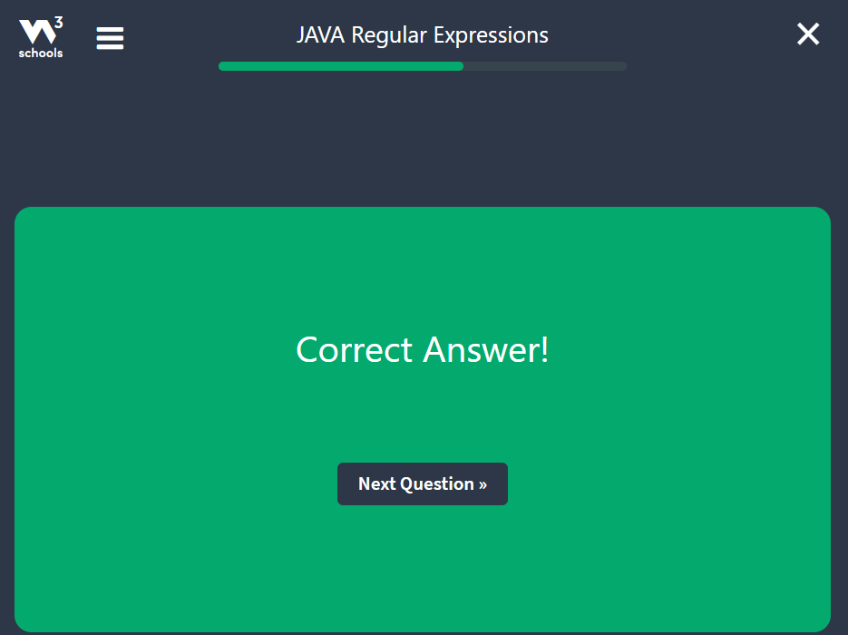
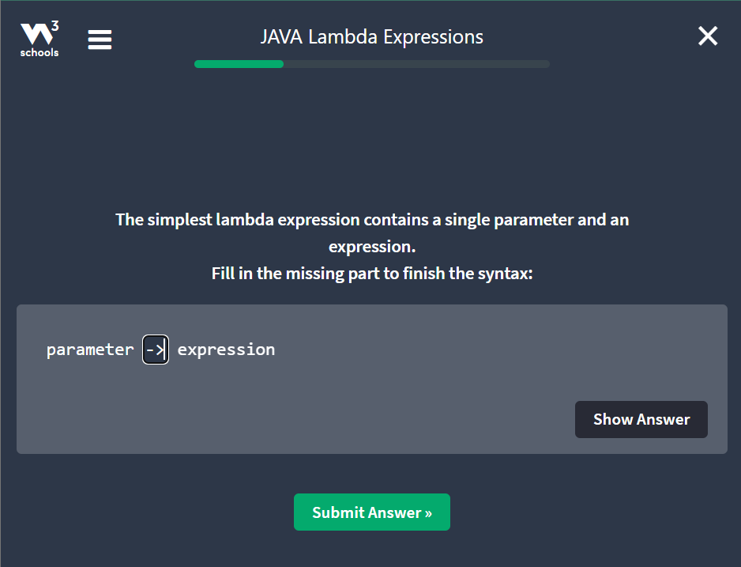
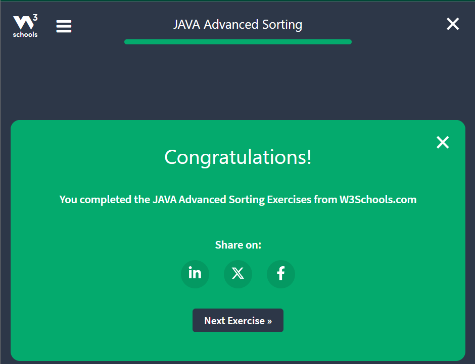

# Week 7 assignment notes
## Java Advanced part-2 (week 7)
### Java Regular Expressions
**What is a Regular Expression?**
- A regular expression is a sequence of characters that forms a search pattern.
- When we search for data in a text, we can use this search pattern to describe what we are searching for.
- A regular expression can be a single character, or a more complicated pattern.
- Regular expressions can be used to perform all types of **text search** and **text replace** operations.
- Java does not have a built-in Regular Expression class, but we can import the ``java.util.regex`` package to work with regular expressions.
- The package includes the following classes:
  - ``Pattern`` Class - Defines a pattern (to be used in a search).
  - ``Matcher`` Class - Used to search for the pattern
  - ``PatternSyntaxException`` Class - Indicates syntax error in a regular expression pattern.

```java
// To find out if there are any occurences of the word "rishav" in a sentence:
import java.util.regex.Matcher;
import java.util.regex.Pattern;

public class Main {
    public static void main(String[] args) {
        Pattern pattern = Pattern.compile("rishav", Pattern.CASE_INSENSITIVE);
        Matcher matcher = pattern.matcher("We are Rishav's friends");
        boolean matchFound = matcher.find();
        if (matchFound) {
            System.out.println("Match found");
        } else {
            System.out.println("Match not found");
        }
    }
}
```

**Example Explained**
- In this example, the word "rishav" is being searched for in a sentence.
- First, the pattern is created using the ``Pattern.compile()`` method. The first parameter indicates which pattern is being searched for and the second parameter has a flag to indicates that the search should be case-insensitive. The second parameter is optional.
- The ``Matcher()``method is used to search for the pattern in a string. It returns a Matcher object which contains information about the search that was performed.
- The ``find()`` method returns true if the pattern was found in the string and false if it was not found.

### Flags in Regular Expression (Java)
- Flags in the ``compile()`` method change how the search is performed. Here are few of them:
  - ``Pattern.CASE_INSENSITIVE`` - The case of letters will be ignored when performing a search.
  - ``Pattern.LITERAL`` - Special characters in the pattern will not have any special meaning and will be treated as ordinary characters when performing a search.
  - ``Pattern.UNICODE_CASE`` - Use it together with the ``CASE_INSENSITIVE`` flag to also ignore the case of letters outside of the English Alphabet.

### Regular Expression Patterns
- The first parameter of the ``Pattern.compile()`` method is the pattern.
- It describes what is being searched for.
- Brackets are used to find a range of characters:
  - ``[abc]`` : Find one character from the options between the brackets.
  - ``[^abc]`` : Find one character NOT between the brackets.
  - ``[0-9]`` : Find one character from the range 0 to 9.

### Metacharacters
- Metacharacters are characters with a special meaning:
  - ``|`` : Find a match for any one of the patterns separated by | as in: cat|dog|fish
  - ``.`` : Find just one instance of any character
  - ``^`` : Finds a match as the beginning of a string as in: ^Hello
  - ``$`` : Finds a match at the end of the string as in: World$
  - ``\d`` : Find a digit
  - ``\s`` : Find a whitespace character
  - ``\b`` : Find a match at the beginning of a word like this: \bWORD, or at the end of a word like this: WORD\B
  - ``\uxxxx`` : Find the Unicode character specified by the hexadecimal number xxxx

### Quantifiers
- Quantifiers define quantities:
  - ``n+`` : Matches any string that contains at least one _n_
  - ``n*`` : Matches any string that contains zero or more occurences of _n_
  - ``n?`` : Matches any string that contains zero or one occurences of _n_
  - ``n{X}`` : Matches any string that contains a sequence of _X n_'s
  - ``n{X,Y}`` : Matches any string that contains a sequence of X to Y _n_'s
  - ``n{X,}`` : Matches any string that contains a sequence of at least X _n_'s

### Java Regular Expression Exercises
#### Question 1


#### Question 2


#### Question 3


#### Question 4


#### Question 5

#### Exercise Completed


### Java Threads
- Threads allows a program to operate more efficiently by doing multiple things at the same time.
- Threads can be used to perform complicated tasks in the background without interrupting the main program.
### Creating a Thread
- There are two ways to create a thread.
- It can be created by extending the ``Thread`` class and overriding its ``run()`` method:
```java
public class Main extends Thread {
    public void run() {
      System.out.println("This code is running in a thread");
    }
}
```
- Another way to create a thread is to implement the ``Runnable``interface:
```java
// Implement Syntax
public class Main implements Runnable {
    public void run() {
      System.out.println("This code is running in a thread");
    }
}
```
### Running Threads
- If the class extends the ``Thread`` class, the thread can be run by creating an instance of the class and call its ``start()`` method:
```java
public class Main extends Thread {
  public static void main(String[] args) {
    Main thread = new Main();
    thread.start();
    System.out.println("This code is outside of the thread");
  }
  
  public void run() {
    System.out.println("This code is running in a thread");
  }
}
```
- If the class implements the ``Runnable`` interface, the thread can be run by passing an instance of the class to a ``Thread`` object's constructor and then calling the thread's ``start()`` method:
```java
// Implement Example
public class Main implements Runnable {
  public static void main(String[] args) {
    Main obj = new Main();
    Thread thread = new Thread(obj);
    thread.start();
    System.out.println("This code is outside of the thread");
  }
  
  public void run() {
    System.out.println("This code is running in a thread");
  }
}
```

**Difference between "extending" and "implementing" Threads**
- The major difference is that when a class extends the Thread class, we cannot extend any other class,
- but, by implementing the Runnable interface, it is possible to extend from another class as well, like: class ``MyClass extends OtherClass implements Runnable``

### Concurrency Problems
- Because threads run at the same time as other parts of the program, there is no way to know in which order the code will run.
- When the threads and main program are reading and writing the same variables, the values are unpredictable.
- The problem that result from this are called concurrency problems.

```java
// A code example where the value of the variable amount is unpredictable:
public class Main extends Thread {
    public static int amount = 0;

  public static void main(String[] args) {
    Main thread = new Main();
    thread.start();
    System.out.println("The code running outside the thread: " + amount);
    amount++;
    System.out.println("The amount after amount++ : " + amount);
  }
  
  public void run() {
      amount++;
  }
}
```

- To avoid concurrency problems, it is best to share as few attributes between threads as possible.
- if attributes need to be shared, one possible solution is to use the ``isAlive()`` method of the thread to check whether the thread has finished running before using any attributes that the thread can change.

```java
// use isAlive() to prevent concurrency problems
public class Main extends Thread {
    public static int amount = 0;

  public static void main(String[] args) {
    Main thread = new Main();
    thread.start();
    // Wait for the thread to finish
    while(thread.isAlive()) {
      System.out.println("Waiting...");
    }
    // Update amount and print it's value
    System.out.println("Main: " + amount);
    amount++;
    System.out.println("Main: " + amount);
  }
  
  public void run() {
      amount++;
  }
}
```

### Java Threads exercise
#### Question 1


#### Question 2


#### Question 3

#### Exercise Completed


### Java Lambda Expressions
- Lambda Expressions were added in Java 8.
- A lambda expression is a short block of code which takes in parameters and returns a value.
- Lambda expressions are similar to methods, but they do not need a name and they can be implemented right in the body of a method.

#### lambda syntax
- The simplest lambda contains a single parameter and an expression:
```commandline
parameter -> expression
```
- To use more than one parameter, wrap them in parentheses:
```commandline
(parameter1, parameter2) -> expression
```
- Expressions are limited.
- They have to immediately return a value, and they cannot contain variables, assignments, or statements such as ``if`` or ``for``.
- In order to do more complex operations, a code block can be used with curly braces.
- If the lambda expression needs to return a value, then the code block should have a ``return`` statement.
```commandline
(parameter1, parameter2) -> { code block }
```

### Using Lambda Expressions
- Lambda expressions are usually passed as parameters to a function:
```java
// Use a lambda expression in the ArrayList's forEach() method to print every item in the list:
import java.util.ArrayList;

public class Main {
  public static void main(String[] args) {
    ArrayList<Integer> numbers = new ArrayList<Integer>();
    numbers.add(5);
    numbers.add(23);
    numbers.add(14);
    numbers.add(3);
    
    numbers.forEach( (n) -> {
      System.out.println(n);
    });
  }
}
```
- Lambda expressions can be stored in variables if the variable's type is an **interface which has only one method**.
- The lambda expression should have the same number of parameters and the same return type as that method.
- Java has many of these kinds of interfaces built in, such as the ``Consumer`` interface (found in the ``java.util`` package) used by lists.

```java
// Use Java's Consumer interface to store a lambda expression in a variable:
import java.util.ArrayList;
import java.util.function.Consumer;

public class Main {
  public static void main(String[] args) {
    ArrayList<Integer> numbers = new ArrayList<Integer>();
    
    numbers.add(5);
    numbers.add(23);
    numbers.add(14);
    numbers.add(3);
    
    Consumer<Integer> method = (n) -> {
      System.out.println(n);
    };
    
    numbers.forEach( method );
  }
}
```

- To use a lambda expression in a method, the method should have a parameter with a single-method interface as it's type.
- Calling the interface's method will run the lambda expression
```java
// Create a method which takes a lambda expression as a parameter
@FunctionalInterface
interface StringFunction {
    String run(String str);
}

public class Main {
  public static void main(String[] args) {
    StringFunction exclaim = (s) -> s + "!";
    /*
            This is tantamount to:
    StringFunction exclaim = new StringFunction() {
    public String run(String s) {
        return s + "!";
    }
}; // so , we are actually implementing the run() method of the StringFunction interface
     */
    StringFunction ask = (s) -> s + "?";
    StringFunction rishav = (s) -> s + "rishav are friends";
    printFormatted("Hello", exclaim);
    printFormatted("Hello", ask);
    printFormatted("Shivam", rishav);
  }
  
  public static void printFormatted(String str, StringFunction format) {
      String result = format.run(str);
    System.out.println(result);
  }
}
```

### Lambda Expression exercise
#### Question 1


#### Question 2


#### Question 3


#### Question 4

#### Exercise Completed


### Java Advanced Sorting (Comparator and Comparable)
- In the List Sorting Chapter, we learned how to sort lists alphabetically and numerically:
```java
import java.util.ArrayList;
import java.util.Collections;  // Import the Collections class

public class Main {
  public static void main(String[] args) {
    ArrayList<String> cars = new ArrayList<String>();
    cars.add("Volvo");
    cars.add("BMW");
    cars.add("Ford");
    cars.add("Mazda");

    Collections.sort(cars);  // Sort cars
    // Collections.sort(cars, Collections.reverseOrder()); // Sort cars in reverse order

    for (String i : cars) {
      System.out.println(i);
    }
  }
}
```
- **But, what if the list has objects in it?**
- So, to sort objects we need to specify a rule that decides how objects should be sorted.
- For example, if we have a list of cars, we might want to sort them by year, the rule should be that cars with an earlier year go first.
- The ``Comparator`` and ``Comparable`` interfaces allow us to specify what rule is used to sort objects.
- Being able to specify a sorting rule also allows us to change how string and numbers are sorted.

### Comparators
- An Object that implements the ``Comparator`` interface is called a comparator.
- The ``Comparator`` interface allows us to create a class with a ``compare()`` method that compares two objects to decide which one should go first in a list.
- The ``compare()`` method should return a number which is:
  - Negative if the first object should go first in a list.
  - Positive if the second object should go first in a list.
  - Zero if the order does not matter.
- A class that implements the ``Comparator`` interface might look something like this:

```java
import java.util.Comparator;

// Sort Car objects by year
class SortByYear implements Comparator {
  // defining compare methods with parameter Object obj1, and, Object2
  public int compare(Object obj1, Object obj2) {
      // Make sure that the objects are Car objects
    Car a = (Car) obj1;
    Car b = (Car) obj2;
  }
  
  // compare the objects
  if (a.year < b.year) return -1; // The first car has a smaller year
  if (a.year > b.year) return 1; // The first car has a larger year
  return 0; // Both cars have the same year
}
```
- To use the comparator, pass it as an argument into a sorting method:

```java
// Use a comparator to sort the cars

import java.util.Collections;
import java.util.Comparator;

Comparator myComparator = new SortByYear();
Collections.sort(myCars, myComparator)
```
- The entire example using a comparator to sort a list of cars by year;

```java
import java.util.ArrayList;
import java.util.Collections;
import java.util.Comparator;

// Define a Car class
class Car {
  public String brand;
  public String model;
  public int year;

  public Car(String b, String m, int y) {
    brand = b;
    model = m;
    year = y;
  }
}

// Create a comparator
class SortByYear implements Comparator {
  public int compare(Object obj1, Object obj2) {
    // Make sure that the objects are Car objects
    Car a = (Car) obj1;
    Car b = (Car) obj2;

    // Compare the year of both objects
    if (a.year < b.year) return -1; // The first car has a smaller year
    if (a.year > b.year) return 1; // The first car has a larger year
    return 0; // Both cars have the same year
  }
}

public class Main {
  public static void main(String[] args) {
    // Create a list of cars
    ArrayList<Car> myCars = new ArrayList<Car>();
    myCars.add(new Car("BMW", "X5", 1999));
    myCars.add(new Car("Honda", "Accord", 2006));
    myCars.add(new Car("Ford", "Mustang", 1970));

    // Use a comparator to sort the cars
    Comparator myComparator = new SortByYear();
    Collections.sort(myCars, myComparator);
    
    // Display the cars
    for (Car c : myCars) {
      System.out.println(c.brand + " " + c.model + " " + c.year);
    }
  }
}
```

### Using a Lambda Expression
- To make the code shorter, the comparator can be replaced with a lambda expression
- which has the same arguments and return value as the ``compare()`` method:

```java
// Use a lambda expression as a comparator

import java.util.Collections;

Collections.sort(myCars, (obj1, obj2) -> {
    Car a = (Car) obj1;
    Car b = (Car) obj2;
    if (a.year < b.year) return -1;
    if (a.year > b.year) return 1;
    return 0;
})
```

### Special Sorting Rules
- Comparators can also be used to make special sorting rules for string and numbers.
- In this example, we use a comparator to list all of the even numbers before the odd ones:

```java
import java.util.ArrayList;
import java.util.Collections;
import java.util.Comparator;

class SortEvenFirst implements Comparator {
  public int compare(Object obj1, Object obj2) {
    // Make sure the objects are integer
    Integer a = (Integer) obj1;
    Integer b = (Integer) obj2;

    // Check each number to see if it is even
    // A number is even if the remainder when dividing by 2 is 0
    boolean aIsEven = (a % 2) == 0;
    boolean bIsEven = (b % 2) == 0;

    if (aIsEven == bIsEven) {
      // if both numbers are even or both are odd then use normal sorting rules
      if (a < b) return -1;
      if (a > b) return 1;
      return 0;
    } else {
      // If a is even then it goes first, otherwise b goes first
      if (aIsEven) {
        return -1;
      } else {
        return 1;
      }
    }
  }
}

public class Main {
  public static void main(String[] args) {
    ArrayList<Integer> myNumbers = new ArrayList<Integer>();
    myNumbers.add(5);
    myNumbers.add(14);
    myNumbers.add(23);
    myNumbers.add(3);
    myNumbers.add(4);
    myNumbers.add(10);

    Comparator myComparator = new SortEvenFirst();
    Collections.sort(myNumbers, myComparator);
    
    for (int i : myNumbers) {
      System.out.println(i);
    }
  }
}
```

### The Comparable Interface
- The ``Comparable`` interface allows an object to specify its own sorting rule with a ``compareTo()`` method.
- The ``compareTo()`` method takes an object as an argument and compares the comparable with the argument to decide which one should go first in a list.
- Like the comparator, the ``compareTo()``method returns a number which is:
  - Negative if the comparable should go first in a list.
  - Positive if the other object should go first in a list.
  - Zero if the order does not matter.

**Note:**
- Many native Java classes implement the ``Comparable`` interface, such as ``String`` and ``Integer``.
- This is why strings and numbers do not need a comparator to be sorted.

An object that implements the ``Comparable`` interface might look something like this:
```java
class Car implements Comparable {
    public String brand;
    public String model;
    public int year;
    
    // Decide how this object compares to other objects
  public int compareTo(Object obj) {
      Car other = (Car) obj;
      if (year < other.year) return -1; // This object is smaller than the other one
      if (year > other.year) return 1; // This object is larger than the other one.
      return 0; // Both objects are the same
  }
}
```
- Here is the same example as before but using the ``Comparable`` interface instead of a comparator:

```java
import java.util.ArrayList;
import java.util.Collections;

class Car implements Comparable {
  public String brand;
  public String model;
  public int year;

  public Car(String b, String m, int y) {
    brand = b;
    model = m;
    year = y;
  }

  // Decide how this object compares to other objects
  public int compareTo(Object obj) {
    Car other = (Car) obj;
    if (year < other.year) return -1; // This object is smaller than the other one.
    if (year > other.year) return 1; // this object is larger than the other one.
    return 0; // Both objects are the same
  }
}

public class Main {
  public static void main(String[] args) {
    // Create a list of cars
    ArrayList<Car> myCars = new ArrayList<Car>();
    myCars.add(new Car("BMW", "X5", 1999));
    myCars.add(new Car("Honda", "Accord", 2006));
    myCars.add(new Car("Ford", "Mustang", 1970));

    // Sort the cars
    Collections.sort(myCars);
    
    // Display the cars
    for (Car c : myCars) {
      System.out.println(c.brand + " " + c.model + " " + c.year);
    }
  }
}
```

#### A common sorting trick
- The most obvious way to sort two numbers naturally is to write something like this:
```java
if (a.year < b.year) return -1; // a is less than b
if (a.year > b.year) return 1; // a is greater than b
return 0; // a is equal to b
```
- But, it can actually be done with just a single line:
```java
return a.year - b.year;
```
- This trick can also be used to easily sort things in reverse:
```java
return b.year - a.year;
```

### Comparator vs. Comparable
- A comparator is an object with one method that is used to compare two different objects.
- A comparable is an object which can compare itself with other objects.
- It is easier to use the ``Comparable`` interface when possible, but the ``Comparator`` interface is more powerful because it allows us to sort any kind of object even if we cannot change its code.

### Java Advanced Sorting
#### Question 1


#### Question 2


#### Question 3

#### Exercise Completed


