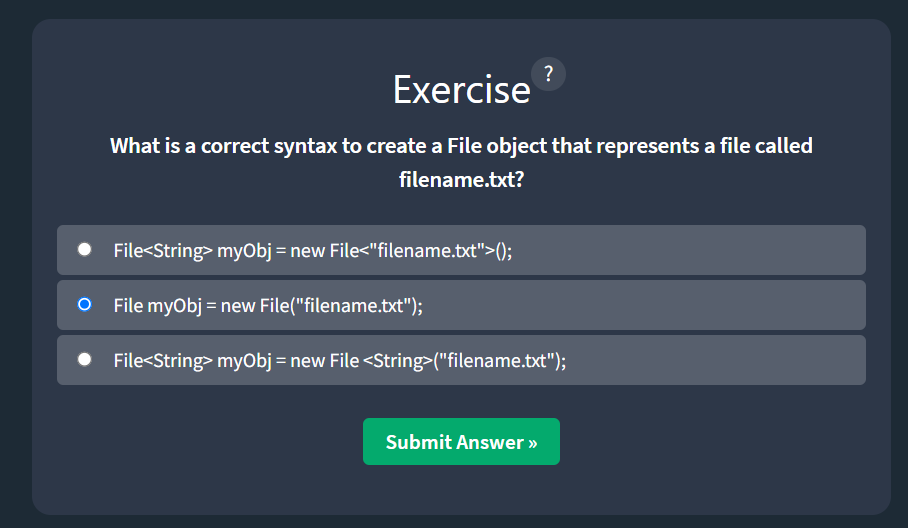
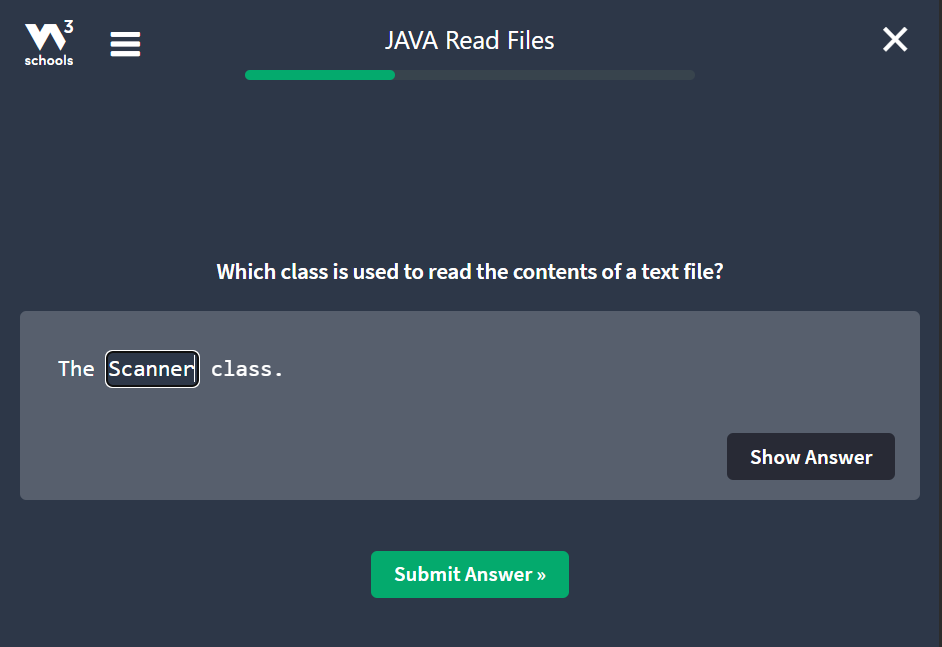
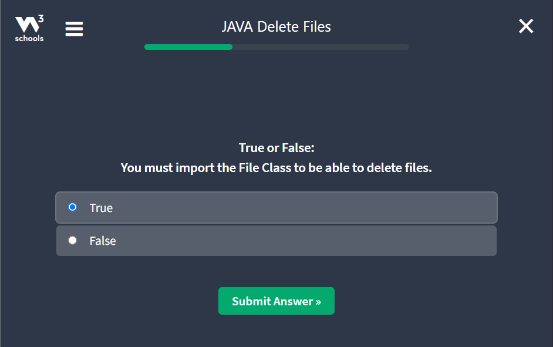

# Week 8 Assignment notes

## Java File Handling

### Java Files
- File handling is an important part of any application.
- Java has several methods for:
  - **Creating Files**
  - **Reading Files**
  - **Updating Files**
  - **Deleting Files**

### Java File Handling
- The ``File`` class from the ``java.io`` package, allows us to work with files.
- To use the ``File`` class, we create an object of the class, and specify the filename or directory name:

```java
import java.io.File; // importing File class from the java.io package

File myObj = new File("fileName.txt");  // specifying the filename
```
- The ``File`` class has many useful methods for creating and getting information about files.
- For example (Method -> Type -> Description):
  - ``canRead()`` -> ``Boolean`` -> It tests whether the file is readable or not.
  - ``canWrite()`` -> ``Boolean`` -> It tests whether the file is writable or not.
  - ``createNewFile()`` -> ``Boolean`` -> It creates an empty file
  - ``delete()`` -> ``Boolean`` -> It deletes a file.
  - ``exists()`` -> ``Boolean`` -> it tests whether the file exists.
  - ``getName()`` -> ``String`` -> Returns the name of the file.
  - ``getAbsolutePath()`` -> ``String`` -> Returns the absolute pathname of the file
  - ``length()`` -> ``Long`` -> Returns the size of the file in bytes.
  - ``list()`` -> ``String[]`` -> Returns an array of the files in the directory.
  - ``mkdir()`` -> ``Boolean`` -> creates a directory

### Java Files Exercise
#### Question 1


#### Question 2


#### Question 3

#### Exercise Completed


### Java Create and Write to Files
**Create a File**
- To create a file in Java, we can use the ``createNewFile()`` method.
- This method returns a boolean value: ``true`` if the file was successfully created, and ``false`` if the file already exists.
- Note  that the method is enclosed in a ``try...catch`` block.
- This is necessary because it throws an ``IOException`` if an error occurs (if the file cannot be created for some reason):

```java
import java.io.File;
import java.io.IOException;

public class CreateFile {
  public static void main(String[] args) {
    try {
        File myObj = new File("rishav.txt");
        if (myObj.createNewFile()) {
          System.out.println("File created: " + myObj.getName());
        } else {
          System.out.println("File already exists. ");
        }
    } catch (IOException e) {
      System.out.println("Error occured: " + e.getMessage());
      e.printStackTrace();
    }
  }
}
```
- To create a file in a specific directory (requires permission),
  - specify the path of the file
  - and, use double backslashes to escape the "``\``" character (for windows).
  - On Mac and Linux, we can just write the path, like: /Users/name/fileName.txt
```java
File myObj = new File("C:\\Users\\MyName\\fileName.txt");
```

### Write To a File
- In the following example, we use the ``FileWriter`` class together with its ``write()`` method
  - This is done to write some text to the file we created in above example.
- But, do Note that when we are done writing to the file, we should close it with the ``close()`` method:

```java
import java.io.FileWriter; 
import java.io.IOException;

public class WriteToFile {
  public static void main(String[] args) {
    try {
        FileWriter myWriter = new FileWriter("fileName.txt");
        myWriter.write("Files in Java might be tricky, but it is fun enough!");
        myWriter.close();
      System.out.println("Successfully wrote to the file.");
    } catch (IOException e) {
      System.out.println("An error occured: " + e.getMessage());
      e.printStackTrace();
    }
  }
}
```

### Java create/write files exercises
#### Question 1


#### Question 2


#### Question 3

#### Exercise completed


### Java Read Files
**Read a File**
- In the previous chapter, we learned how to create and write to a file.
- In the following example, we use the ``Scanner`` class to read the contents of the text file we created in the previous chapter.

```java
import java.io.File;
import java.io.FileNotFoundException;
import java.util.Scanner;

public class ReadFile {
  public static void main(String[] args) {
    try {
        File myObj = new File("fileName.txt");
        Scanner myReader = new Scanner(myObj);
        while (myReader.hasNextLine()) {
            String data = myReader.nextLine();
          System.out.println(data);
        }
        myReader.close();
    } catch (FileNotFoundException e) {
      System.out.println("An error occured.");
      e.printStackTrace();
    }
  }
}
```

### Get File information
- To get more information about a file, use any of the ``File`` methods:
```java
import java.io.File;

public class GetFileInfo {
  public static void main(String[] args) {
    File myObj = new File("fileName.txt");
    if (myObj.exists()) {
      System.out.println("File name: " + myObj.getName());
      System.out.println("Absolute path: " + myObj.getAbsolutePath());
      System.out.println("Writable: " + myObj.canWrite());
      System.out.println("Readable: " + myObj.canRead());
      System.out.println("File size in bytes: " + myObj.length());
    } else {
      System.out.println("The file does not exist.");
    }
  }
}
```

**Note:**
- There are many available classes in the Java API that can be used to read and write files in Java:
  - ``FileReader``
  - ``BufferedReader``
  - ``Files``
  - ``Scanner``
  - ``FileInputStream``
  - ``FileWriter``
  - ``BufferedWriter``
  - ``FileOutputStream``
- Which one to use depends on the Java version we're working with,
- and, Whether we need to read bytes or characters, and the size of the file/lines etc. also depends on it.

### Java Read Files Exercise
#### Question 1


#### Question 2


#### Question 3

#### Exercise Completed


### Java Delete Files
**Delete a File**
- To delete a file in Java, use the ``delete()`` method:
```java
import java.io.File; 

public class DeleteFile {
  public static void main(String[] args) {
    File myObj = new File("fileName.txt");
    if (myObj.delete()) {
      System.out.println("Deleted the file: " + myObj.getName());
    } else {
      System.out.println("Failed to delete the file.");
    }
  }
}
```

### Delete a Folder
- We can also delete a folder. However, it must be empty:
```java
import java.io.File;

public class DeleteFolder {
  public static void main(String[] args) {
    File myObj = new File("C:\\Users\\MyName\\Test");
    if (myObj.delete()) {
      System.out.println("Deleted the folder: " + myObj.getName());
    } else {
      System.out.println("Failed to delete the folder.");
    }
  }
}
```

### Java Delete Files Exercise
#### Question 1


#### Question 2


#### Question 3

#### Exercise Completed
