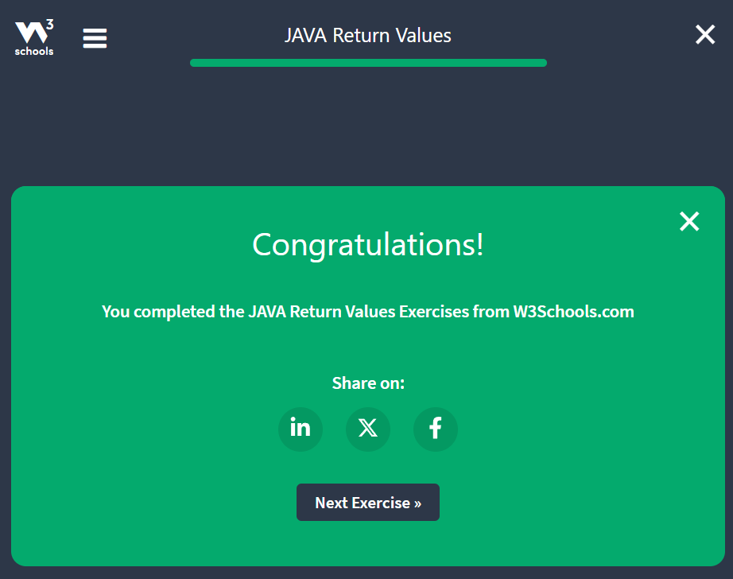

# Week 4 Assignment notes

## Java Methods
- A ``method`` is a block of code which only runs when it is called.
- We can pass data, known as parameters, into a method.
- Methods are used to perform certain actions, and they are also known as **functions**.
### Create a Method
- A method must be declared within a class.
- It is defined with the name of the method, followed by parantheses ().
- Java provides some pre-defined methods, such as ``System.out.println()``, but we can also create our own methods to perform certain actions:

```java
public class Main(){
    static void myMethod() {
        // Code to be executed
    }
}
```
#### Example Explained
- ``myMethod()`` is the name of the method
- ``static`` means that the method belongs to the Main class and not an object of the Main class. 
- ``void`` means that this method does not have a return value. We will learn more about return values later in this chapter.

### Call a Method
- To call a method in Java, we write the method's name followed by parantheses() and a semicolon;
```java
public class Main {
    static void myMethod() {
        System.out.println("I just got too rich!");
    }

    public static void main(String[] args) {
        myMethod();
    }
}
```
- method can also be called multiple times:
```java
public class Main {
    static void myMethod() {
        System.out.println("I just got too rich!");
    }

    public static void main(String[] args) {
        myMethod();
        myMethod();
        myMethod();
    }
}
```
### Java Method Exercises
#### Question 1


#### Question 2


#### Question 3


#### Question 4

#### Exercise Completed


## Java Method Parameters
### Parameters and Arguments
- Information can be passed to methods as a parameter. Parameter act as variables inside the method.
- Parameters are specified after the method name, inside the parantheses. We can add as many parameters as we want. We just need to separate them with the comma.
```java
public class Main {
    static void myMethod(String fname) {
        System.out.println(fname + "Refsnes");
    }

    public static void main(String[] args) {
        myMethod("Rishav");
        myMethod("Jenny");
        myMethod("Anja");
    }
}
```
- When a parameter is passed to the method, it is called argument. So, from the example above: ``fname`` is a parameter, while ``Rishav``, ``jenny``, and ``Anja`` are arguments.

### Multiple Parameters
```java
// we can have multiple parameters as we like
public class Main {
    static void myMethod(String fname, int age) {
        System.out.println(fname + " is " + age);
    }

    public static void main(String[] args) {
        myMethod("Rishav", 22);
        myMethod("Jenny", 23);
        myMethod("Anja", 20);
    }
}
```
### A method with If...Else
- It is common to use ``if...else`` statements inside methods:
```java
public class Main {
    // creating a checkAge() method with an integer variable called age
    static void checkAge(int age) {
        if (age < 18) {
            System.out.println("Access denied - you are not old enough!");
        } else {
            System.out.println("Access granted - you are old enough!");
        }
    }

    public static void main(String[] args) {
        checkAge(20);
    }
}
```
### Java Method Parameters Exercise
#### Question 1


#### Question 2


#### Question 3


#### Question 4

#### Exercise Completed


## Java Return Values
### Return Values
- ``void`` keyword indicates that the method should not return a value
- So, if we want the method to return a value, we can use a primitive data types (such as ``int``, ``char``, etc.)
- So, instead of ``void``, we use ``return`` keyword inside the method
```java
public class Main {
    static int myMethod(int x) {
        return 5 + x;
    }

    public static void main(String[] args) {
        System.out.println(myMethod(3));
    }
}
```
- Now, if we want to return the sum of method's two parameters:
```java
public class Main {
    static int myMethod(int x, int y) {
        return x + y;
    }

    public static void main(String[] args) {
        System.out.println(myMethod(5, 3));
    }
}
```
- We can also store the result in a variable (recommended, as it is easier to read and maintain):
```java
public class Main {
    static int myMethod(int x, int y) {
        return x + y;
    }

    public static void main(String[] args) {
        int z = myMethod(5, 3);
        System.out.println(z);
    }
}
```
### Java Method Return Exercises
#### Question 1


#### Question 2


#### Question 3


#### Question 4

#### Exercise Completed


## Java Method Overloading
### Method Overloading
- With **method overloading**, multiple methods can have the same name with different parameters:
```java
// Example
int myMethod(int x);
float myMethod(float x);
double myMethod(double x, double y);
```
- Let's take the example of two methods that add numbers of different type:
```java
static int plusMethodInt(int x, int y) {
    return x + y;
}

static double plusMethodDouble(double x, double y) {
    return x + y;
}

public static void main(String[] args) {
    int myNum1 = plusMethodInt(3, 5);
    double myNum2 = plusMethodInt(3.3, 5.5);
    System.out.println("Int: " + myNum1);
    System.out.println("Double: " + myNum2);
}
```
- Instead of defining two methods that should do the same thing, it is better to overload one.
- Multiple methods can have the same name as long as the number and/or type of parameters are different.

### Java Method Overloading Exercise
#### Question 1


#### Question 2


#### Question 3

#### Exercise Completed


## Java Scope
### Java Scope
- In java, variables are only accessible inside the region they are created. This is called **scope**.
### Method Scope
- Variables declared directly inside a method are available anywhere in the method following the line of code in which they were declared:
```java
public class Main {
    public static void main(String[] args) {
        // Here we cannot use x
        
        int x = 5;
        
        // from, here we can use the value of x
        System.out.println(x);
    }
}
```
### Block Scope
- A block of code refers to all of the code between curly braces ``{}``.
- Variables declared inside blocks of code are only accessible by the code between the curly braces, which follows the line in which the variable was declared.
```java
public class Main {
    public static void main(String[] args) {
        // Code here cannot use value of x
        {
            // This is the block of the code
            // Code here cannot use x
            
            int x = 5;
            // code here can use x
            System.out.println(x);
        }
        // Now, the block ends here
        // here, we cannot use value of x
    }
}
```
- The block of code may exist on it's own or it can belong to an ``if``, ``while``, or ``for`` statement.
- In the case of ``for`` statements, variables declared in the statement itself are also available inside the block's scope.
### Java Scope Exercise
#### Question 1


#### Question 2


#### Question 3

#### Exercise Completed


## Java Recursion
### Java Recursion
Recursion is the technique of making a function call itself.
- The technique provides a way to break complicated problems down into simple problems which are easier to solve.
- Recursion may be a bit difficult to understand. The best way to figure out how it works is to experiment with it.
### Recursion Example
- Adding two numbers together is easy to do, but adding a range of numbers is more complicated.
- In the following example, recursion is used to add a range of numbers together by breaking it down into the simple tasks of adding two numbers:
```java
public class Main {
    public static void main(String[] args) {
        int result = sum(10);
        System.out.println(result);
    }
    
    // Here, k is 10
    /*
     when, we declare sum(10),
     it checks if 10 is greater than 0,
     Since, it is true,
     it will return 10 + sum(9)
     Now, again we call sum(9),
     condition is true,
     return, 9 + sum(8)
     and so on, like 8 + sum(7), 7 + sum(6), 6 + sum(5), 5 + sum(4), 4 + sum(3), 3 + sum(2), 2 + sum(1), 1 + sum(0)
     now, since 0 came now, we will return value 0;
     but where it is stored?
     it is stored in result where the value is keep overwriting and overwriting,
     result: 10 + 9 + 8 + 7 + 6 + 5 + 4 + 3 + 2 + 1 + 0 at last, sum(value) will never be there.
     so, result: 55 which is printed.
     */
    public static int sum(int k) {
        if (k > 0) {
            return k + sum(k - 1);
        } else {
            return 0;
        }
    }
}
```
#### Example Explained
- When the sum() function is called, it adds parameter ``k`` to the sum of all numbers than k  and returns the result.
- When ``k`` becomes 0, the function just returns 0.
```commandline
10 + sum(9)
10 + ( 9 + sum(8) )
10 + (9 + ( 8 + sum(7)))
and so, on
until:
10 + 9 + 8 + 7 + 6 + 5 + 4 + 3 + 2 + 1 + 0
```
- Since, the function does not call itself when ``k`` is 0, the program stops there and returns the result.

### Halting Condition
- Just as loops can run into the problem of infinite looping, recursive functions can run into the problem of infinite recursion.
- Infinite recursion is when the function never stops calling itself.
- Every recursive function should have a halting condition, which is the condition where the function stops calling itself.
- In the previous example, the halting condition is when the parameter ``k`` becomes 0.

```java
public class Main {
    public static void main(String[] args) {
        int result = sum(5, 10);
        System.out.println(result);
    }
    
    public static int sum(int start, int end) {
        if (end > start) {
            return end + sum(start, end - 1);
        } else {
            return end;
        }
    }
}
```
- Here, Developer should be careful with recursion as it can be quite easy to slip into writing a function which never terminates, or one that uses excess amounts of memory or processor power.
- However, when written correctly recursion can be a very efficient and mathematically-elegant approach to programming.

### Java Recursion Exercise
#### Question 1


#### Question 2


#### Question 3

#### Exercise Completed


