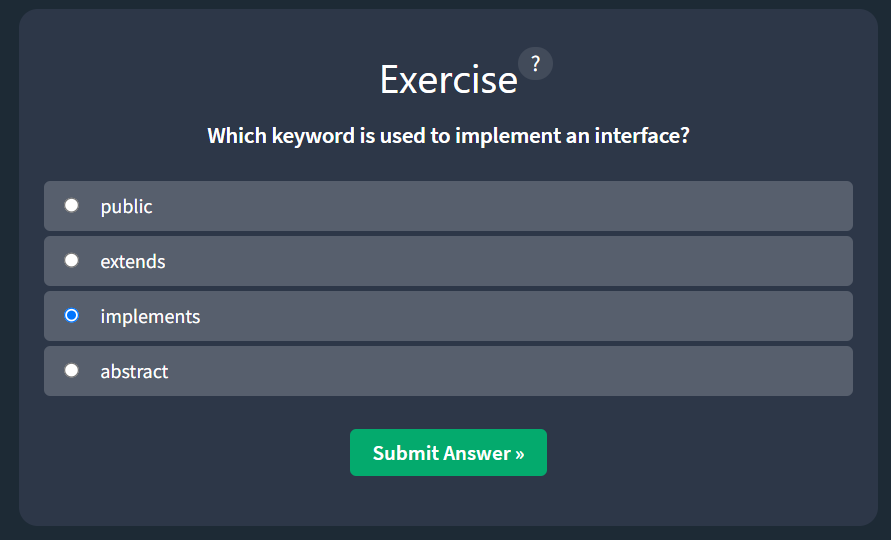

# Week 5 Assignment notes
## Java Classes
### Java OOP
- OOP stands for Object-Oriented Programming
- Procedural programming is about writing procedures or methods that perform operations on the data,
- while object-oriented programming is about creating objects that contain both data and methods.

- Object-oriented programming has several advantages over procedural programming:
  - OOP is faster and easier to execute
  - OOP provides a clear structure for the programs.
  - OOP helps to keep the Java code DRY "Don't Repeat Yourself", and makes the code easier to maintain, modify and debug
  - OOP makes it possible to create full reusable applications with less code and shorter development time.
``The "Don't Repeat Yourself" (DRY) principle is about reducing the repetition of code. We should extract out the codes that are common for the application, and place them at a single place and reuse them instead of repeating it.``
### Java- What are Classes and Objects?
- Classes and objects are the two main aspects of object-oriented programming.

| class | objects |
|-------|---------|
| Fruit | => Apple |
| Fruit | => Banana |
| Fruit | => Mango |

- So, a class is a template for objects, and an object is an instance of a class.
- When the individual objects are created, they inherit all the variables and methods from the class.

### Java OOP Exercise
#### Question 1


#### Question 2


#### Question 3

#### Exercise Completed


### Java Classes and Objects
- Java is an Object-oriented programming language
- Everything in Java is associated with classes and objects, along with its attributes and methods.
- For instance, In real life, a car is an object. The car has **attributes**, such as weight and color, and **methods**, such as drive and brake.

So, A class is like an object contructor, or a "blueprint" for creating objects.

### Creating a class
So, to create a class named "``Main``" with a variable x:
```java
public class Main {
    int x = 5;
}
```
### Creating an Object
- In Java, an object is created from a class. We have already created a class named ``Main``, so now we can use this to create objects.
- To create an object of ``Main``, specify the class name, followed by the object name, and use the keyword ``new``:
```java
public class Main {
    int x = 5; // which is the properties or attributes

  public static void main(String[] args) {
    Main myObj = new Main(); // creating an object
    System.out.println(myObj.x);
  }
}
```
### Multiple Objects
- We can create multiple objects of one class:
```java
public class Main {
    int x = 5;

  public static void main(String[] args) {
    Main myObj1 = new Main(); 
    Main myObj2 = new Main();

    System.out.println(myObj1.x);
    System.out.println(myObj2.x);
  }
}
```

### Using Multiple Classes
- We can also create an object of a class and access it in another class.
- This is often used for better organization of classes ( one class has all the attributes and methods, while the other class holds the ``main()`` method (code to be executed)).
- Remember that the name of the java file should match the class name. In this example, we have created two files in the same directory/folder:
  - Main.java
  - Second.java

```java
// this is the Main.java file code
public class Main {
    int x = 5;
}
```
```java
// this is the Second.java file code
class Second {
  public static void main(String[] args) {
    Main myObj = new Main();
    System.out.println(myObj.x);
  }
}
```
- When both files have been compiled:
```commandline
javac Main.java
javac Second.java
```
- Run the Second.java file:
```commandline
java Second
```
- or, use IDE like IntelliJ or Visual Studio code

### Java Classes and Objects Exercise
#### Question 1


#### Question 2


#### Question 3


#### Question 4


#### Question 5

#### Exercise Completed


### Java Class Attributes
- In the previous chapter, we used the term "variable" for ``x`` in the example (as shown below). It is actually an attribute of the class.
- Or, we could say that class attributes are variables within a class:

```java
// creating a class called Main with two attributes: x and y:
public class Main {
    int x = 5;
    int y = 3;
}
```
- Another term for class attributes is **fields**.

### Accessing Attributes
- We can access attributes by creating an object of the class, and by using the dot syntax(``.``):
- The following example will create an object of the ``Main`` class, with the name ``myObj``. We use the ``x`` attribute on the object to print it's value.

```java
public class Main {
    int x = 5;

  public static void main(String[] args) {
    Main myObj = new Main();
    System.out.println(myObj.x);
  }
}
```
### Modifying Attributes
- We can also modify attribute values:
```java
// setting the value of x to 40
public class Main {
    int x;

  public static void main(String[] args) {
    Main myObj = new Main();
    myObj.x = 40;
    System.out.println(myObj.x);
  }
}
```
- We can also override existing values:
```java
// changing the value of x to 25
public class Main {
    int x = 10;

  public static void main(String[] args) {
    Main myObj = new Main();
    myObj.x = 25; // x is now 25
    System.out.println(myObj.x);
  }
}
```
- If we don't want the ability to override existing values, declare the attribute as ``final``:
```java
public class Main {
    final int x = 10;

  public static void main(String[] args) {
    Main myObj = new Main();
    
    myObj.x = 25; // This will generate an error: cannot assign a value to the final value
    System.out.println(myObj.x);
  }
}
```

- The ``final`` keyword is useful when we want a variable to always store the same value, like PI (3.14159).
- The ``final`` keyword is called a "modifier".

### Multiple Objects
- If we create multiple object of one class, we can change the attribute values in one object, without affecting the attributes values in the other:
```java
public class Main {
    int x = 5;

  public static void main(String[] args) {
    Main myObj1 = new Main(); // Object 1
    Main myObj2 = new Main(); // Object 2
    
    myObj2.x = 25;
    System.out.println(myObj1.x); // outputs 5
    System.out.println(myObj2.x); // outputs 25
  }
}
```
### Multiple Attributes
- We can specify as many attributes as we want:

```java
public class Main {
    String fname = "Rishav";
    String lname = "Chaudhary";
    int age = 22;

  public static void main(String[] args) {
    Main myObj = new Main();
    System.out.println("Name: " + myObj.fname + " " + myObj.lname);
    System.out.println("Age: " + myObj.age);
  }
}
```
- Now, the next chapter will teach us how to create class methods and how to access them with objects.

### Java Class Attributes Exercise
#### Question 1


#### Question 2


#### Question 3


#### Question 4

#### Exercise Completed


### Java Class Methods
- We learned from the Java Methods that methods are declared within a class, and that they are used to perform certain actions:
```java
// Create a method named myMethod() in Main:
public class Main {
    static void myMethod() {
      System.out.println("Hello World!");
    }
}
```
- ``myMethod()`` prints a text (the action), when it is **called.** 
- To call a method, we write the method's name followed by two parantheses () and a semicolon;

```java
public class Main {
    static void myMethod() {
      System.out.println("Hello World!");
    }

  public static void main(String[] args) {
    myMethod();
  }
}
```

### Static vs Public
- We will often see Java programs that have either ``static`` or ``public`` attributes and methods.
- In the example above, we created a ``static`` method, which means that it can be accessed without creating an object of the class, unlike ``static`` method, which means that it can be accessed without creating an object of the class, unlike ``public``, which can only be accessed by objects.

```java
public class Main {
    // Static Method
  static void myStaticMethod() {
    System.out.println("Static methods can be called without creating objects.");
  }
  
  // Public Method
  public void myPublicMethod() {
    System.out.println("Public methods must be called by creating objects");
  }
  
  // Main method
  public static void main(String[] args) {
    myStaticMethod(); // call the static method
    // myPublicMethod(); // this would compile an error
    
    Main myObj = new Main(); // Create an object of Main
    myObj.myPublicMethod(); // Call the public method on the object
  }
}
```
#### We will learn more about these keywords (called modifiers) in the Java Modifiers chapter.

### Access Methods with an Object
```java
// Create a Car Object named myCar. Call the fullThrottle() and speed() methods on the myCar object, and run the program:
public class Main {
    // create a fullThrottle() method
  public void fullThrottle() {
    System.out.println("The car is going as fast as it can!");
  }
  
  // create a speed() method and add a parameter
  public void speed(int maxSpeed) {
    System.out.println("Max speed is: " + maxSpeed);
  }
  
  // Inside main, call the methods on the myCar object
  public static void main(String[] args) {
    Main myCar = new Main(); // Create a myCar object
    myCar.fullThrottle();
    myCar.speed(200);
  }
}
```
#### Example explained
- We created a custom ``Main`` class with ``class`` keyword.
- We created the ``fullThrottle()`` and ``speed()`` methods in the ``Main`` class.
- The ``fulThrottle()`` method and the ``speed()`` method will print out some text, when they are called.
- The ``speed()`` method accepts an ``int`` parameter called ``maxSpeed``
- In order to use the ``Main`` class and it's methods, we need to create an object of the ``Main` class.
- Then, go to the ``main()`` method, which we know by now is a built-in Java method that runs your program (any code inside main is executed).
- By using the ``new`` keyword we created an object with the name ``myCar``.
- Then, we call the ``fulThrottle()`` and ``speed()`` methods on the ``myCar`` object, and run the program using the name of the object ``myCar`` followed by a dot(``.``), followed by the name of the method (``fullThrottle();`` and ``speed(200);``).
- Notice that we add an ``int`` parameter of **200** inside the ``speed()`` method.

#### To access the object's Attributes and Methods
- We use dot(``.``) followed by the attribute or method name, followed by a set of parentheses (), followed by semicolon(``;``).

### Using multiple classes
- Like we specified in the classes chapter, it is a good practice to create an object of a class, and access it in another class.
- Remember that the name of the java file should match the class name.

```java
// Main.java file
public class Main {
    public void fullThrottle() {
      System.out.println("The car is going as fast as it can!");
    }
    
    public void speed(int maxSpeed) {
      System.out.println("Max speed is: " + maxSpeed);
    }
}
```

```java
// Second.java
class Second {
  public static void main(String[] args) {
    Main myCar = new Main(); // Creating a object
    myCar.fullThrottle(); // call the fullThrottle() method
    myCar.speed(200); // call the speed() method
  }
}
```
- Just compile both and run ``Second.java`` file.
- We can also use IDE

### Java Class Methods Exercise
#### Question 1


#### Question 2


#### Question 3

#### Exercise Completed


### Java Constructors
- A constructor in Java is a **special method** that is used to initialize objects.
- The constructor is called when an object of a class is created.
- It can be used to set initial values for object attributes.

```java
public class Main {
    int x;
    
    // constructor usage which is a special method that is used to initialize objects.
    // It is called when an object of a class is created.
    // It can be used to set initial values for object attributes.
  
    public Main() {
        x = 5; // Set the initial value for the class attribute x
    }

    public static void main(String[] args) {
      Main myObj = new Main(); // Creating an object of class Main (This will call the constructor)
      System.out.println(myObj.x); // Print the value of x
    }
}
```
- The constructor name must match the class name and it cannot have a return type (like void).
- Also, note that the constructor is called when the object is created.
- All classes have constructors by default: if we do not create a class constructor yourself, Java creates one for you. However, then we are not able to set initial values for object attributes.

### Constructor Parameters
- Constructors can also take parameters, which is used to initialize attributes.
- The example below adds an ``int y`` parameter to the constructor. Inside the constructor, we set x to y (x=y). When we call the constructor, we pass a parameter to the constructor (5), which will set the value of x to 5:

```java
public class Main {
    int x;
    
    public Main (int y) {
        x = y;
    }

  public static void main(String[] args) {
    Main myObj = new Main(5);
    System.out.println(myObj.x); // outputs 5
  }
}
```
- We can also have as many parameters as we want.
```java
public class Main {
    int modelYear;
    String modelName;
    
    public Main(int year, String name) {
        modelYear = year;
        modelName = name;
    }

  public static void main(String[] args) {
    Main myCar = new Main(1969, "Mustang");
    System.out.println(myCar.modelYear + " " + myCar.modelName); // Outputs 1969 Mustang
  }
}
```
### Java Constructors Exercise
#### Question 1


#### Question 2


#### Question 3


#### Question 4

#### Exercise Completed


### Java Modifiers
- Since, we are quite familiar with the ``public`` keyword that appears in almost all of our examples:
```java
public class Main{}
```
- The ``public`` keyword is an **access modifier**, meaning that it is used to set the access level for classes, attributes, methods, and constructors.
- We divide modifiers into two groups:
  - **Access Modifiers** - controls the access level
  - **Non-Access Modifiers** - do not control access level, but provides other functionality
### Access Modifiers
- For **classes**, we can use either ``public`` or _default_:
  - ``public`` : The class is accessible by any other class
  - _default_ : The class is only accessible by classes in the same package. This is used when we do not specify a modifier.

- For **Attributes, methods, and constructors**, we can use one of the following:
  - ``public`` : The code is accessible for all classes
  - ``private`` : The code is only accessible within the declared class
  - ``default`` : The code is only accessible in the same package. This is used when we do not specify a modifier.
  - ``protected`` : The code is accessible in the same package and **subclasses**.

### Non-Access Modifiers
- For **classes**, we can use either ``final`` or ``abstract``:
  - ``final`` : The class cannot be inherited by other classes.
  - ``abstract`` : The class cannot be used to create objects.
- For **attributes and methods**, we can use one of the following:
  - ``final`` : Attributes and methods cannot be overridden/modified
  - ``static``: Attributes and methods belongs to the class, rather than an object
  - ``abstract`` : Can only be used in the abstract class, and can only be used on methods. The method does not have a body
    - For instance, **abstract void run();** The body is provided by the subclass (inherited from).
  - ``transient`` : Attributes and methods are skipped when serializing the object containing them.
  - ``synchronized`` : Methods can only be accessed by one thread at a time.
  - ``volatile`` : The value of an attribute is not cached thread-locally, and is always read from the "main memory".

### Final
- If we do not want the ability to override existing attribute values, we declare attributes as ``final`` .

```java
public class Main {
    final int x = 10;
    final double PI = 3.14;

  public static void main(String[] args) {
    Main myObj = new Main();
    myObj.x = 50; // will generate an error: cannot assign a value to a **final** variable.
    myObj.PI = 25; // will generate an error: cannot assign a value to a **final** variable.
    System.out.println(myObj.x);
  }
}
```

### Static
- A ``static`` method means that it can be accessed without creating an object of the class, unlike ``public``.

```java
// an example to demonstrate the differencecs between static and public methods:
public class Main {
    // Static Method
  static void myStaticMethod() {
    System.out.println("Static methods can be called without creating objects");
  }
  
  // Public method
  public void myPublicMethod() {
    System.out.println("Public methods must be called by creating objects");
  }
  
  // Main method
  public static void main(String[] args) {
    myStaticMethod(); // call the static method directly
//    myPublicMethod(); // This would output an error
    
    Main myObj = new Main(); // Create an object of Main
    myObj.myPublicMethod(); // Call the public method
  }
}
```

### Abstract
- An ``abstract`` method belongs to an ``abstract`` class, and it does not have a body. The body is provided by the subclass.
```java
// code from filename: Main.java
// abstract class
abstract class Main {
    public String fname = "Rishav";
    public int age = 23;
    public abstract void study(); // abstract method
}

// Subclass (inherit from Main)
class Student extends Main {
    public int graduationYear = 2026;
    public void study() { // the body of the abstract method is provided here
      System.out.println("Studying all day long");
    }
}

// End code from filename: Main.java

// Code from filename: Second.java
class Second {
  public static void main(String[] args) {
    // create an object of the Student class (which inherits attributes and methods from Main)
    Student myObj = new Student();

    System.out.println("Name: " + myObj.fname);
    System.out.println("Age: " + myObj.age);
    System.out.println("Graduation Year: " + myObj.graduationYear);
    myObj.study();
  }
}
```

### Java Modifiers Exercise
#### Question 1


#### Question 2


#### Question 3

#### Exercise Completed


### Java Encapsulation
**Encapsulation**
- The meaning of **Encapsulation** is to make sure that "sensitive" data is hidden from users. To achieve this, we must:
  - declare class variables/attributes as ``private``.
  - provide public **get** and **set** methods to access and update the value of a ``private`` variable.

**Get and Set**
- We learned from the previous chapter that ``private`` variables can only be accessed within the same class (an outside class has no access to it)
- However, it is possible to access them if we provide a public get and set methods.

=> The ``get`` method returns the variable value, and the ``set`` method sets the value.

=> Syntax for both is that they start with either ``get`` or ``set``, followed by the name of the variable, with the first letter in upper calse:

```java
public class Person {
    private String name; // private = restricted accecss
  
  // Getter
    public String getName() {
        return name;
    }
    
    // setter
    public void setName(String newName) {
        this.name = newName;
    }
}
```

- we cannot access the ``name`` attribute because it is declared as ``private``.

```java

public class Main {
  public static void main(String[] args) {
    Person myObj = new Person();
    myObj.name = "Rishav"; // error
    System.out.println(myObj.name); // error
  }
}
```
- If the variable was declared as ``public``, we would expect the output ``Rishav``.

#### We can use the ``getName()`` and ``setName()`` methods to access and update the variable:

```java
public class Main {
  public static void main(String[] args) {
    Person myObj = new Person();
    myObj.setName("Rishav"); // set the value of the name variable to "Rishav"
    System.out.println(myObj.getName());
  }
}
```

#### Why Encapsulation?
- Better control of class attributes and methods
- Class attributes can be made **read-only** (if you only use the ``get`` method), or **write-only** (if we only use the ``set`` method)
- Flexible: the programmer can change one part of the code without affecting other parts.
- Increased security of data

### Java Encapsulation Exercise
#### Question 1


#### Question 2


#### Question 3

#### Exercise Completed


### Java Packages and API
- A package in Java is used to group related classes.
- Think of it as a folder in a file directory.
- We use packages to avoid name conflicts, and to write a better maintainable code.
- Packages are divided into two categories:
  - Built-in Packages (packages from the Java API)
  - User-defined Packages (create your own packages)

### Built-In Packages
- The Java API is a library of prewritten classes, that are free to use, included in the Java Development Environment.
- The library contains components for managing input, database programming, and much much more. The complete list can be found at Oracles website:
  https://docs.oracle.com/javase/8/docs/api/
- The library is divided into **packages** and **classes**. Meaning we can either import a single class (along with its methods and attributes), or a whole package that contain all the classes that belong to the specified package.
- To use a class or a package from the library, we need to use the ``import`` keyword:

```java
import package.name.Class; // Import a single class
import package.name.*; // Import the whole package
```

### Import a Class
- If we find a class we want to use, for example, the ``Scanner`` class, which is used to get user input, write the following code:
```java
import java.util.Scanner;
```
- In the example above,``java.util`` is a package, while ``Scanner`` is a class of the ``java.util`` package.
- To use the ``Scanner`` class, we need to create an object of the class, and use any of the available methods found in the ``Scanner`` class documentation. 
- In our example, we will use the ``nextLine()`` method, which is used to read a complete line:

```java
// Using the Scanner class to get user input
import java.util.Scanner;

class MyClass {
  public static void main(String[] args) {
    Scanner myObj = new Scanner(System.in);
    System.out.println("Enter username");
    
    String userName = myObj.nextLine();
    System.out.println("Username is: " + userName);
  }
}
```

### Import a Package
- There are many packages to choose from. In the previous example, we used the ``Scanner`` class from the ``java.util`` package.
- This package also contains date and time facilities, random-number generator and other utility classes.
- To import a whole package, end the sentence with an asterisk sign (``*``). The following example will import ALL the classes in the ``java.util`` package:

```java
import java.util.*;
```

### User-defined Packages
- To create our own package, we need to understand that Java uses a file system directory to store them.
- Just like folders on our computer:
  - root
    - mypack
      - MyPackageClass.java

- So, to create a package, we need to use the ``package`` keyword:
```java
package mypack;
class MyPackageClass {
  public static void main(String[] args) {
    System.out.println("This is my package!");
  }
}
```
- Then, we can save the file as **MyPackageClass.java**, and compile it:
```commandline
C:\Users\Your Name>javac MyPackageClass.java
```
- Then, compile the package:
```commandline
C:\Users\Your Name>javac -d . MyPackageClass.java
```
- This forces the compile to create the "mypack" package.
- The ``-d`` keyword specifies the destination for where to save the class file. We can use any directory name, like c:/user (windows)
- or, if we want to keep the package within the same directory, we can use the dot sign "``.``", like in the example above.
- **Note:** The package name should be written in lower case to avoid conflict with class names.

So, when we compiled the package in the example above, a new folder was created, called "mypack".

To run the **MyPackageClass.java** file, we write the following:
```commandline
C:\Users\Your Name> java mypack.MyPackageClass
```
- And the output will be:
```commandline
This is my package!
```

### Java Package Exercise
#### Question 1


#### Question 2


#### Question 3

#### Exercise Completed


### Java Inheritance
**Java Inheritance (Subclass and Superclass)**
- In Java, it is possible to inherit attributes and methods from one class to another. We group the "inheritance concept" into two categories:
  - **subclass** (child) - the class that inherits from another class
  - **superclass** (parent) - the class being inherited from
- To inherit from a class, we use the ``extends`` keyword
- For example, here we will inherit the attributes and methods from the ``Vehicle`` class(superclass) to the ``car`` class (subclass). 

```java
class Vehicle {
    protected String brand = "Ford"; // vehicle attribute
    public void honk() {
      System.out.println("Tuut, tuut1");
    }
}

class Car extends Vehicle {
    private String modelName = "Mustang"; // car attributes

  public static void main(String[] args) {
    // Create a myCar Object
    Car myCar = new Car();
    
    // Call the honk() method (from the Vehicle class) on the myCar object
    myCar.honk();
    
    // Display the value of the brand attribute (from the vehicle class) and the value of the modelName from the Car class
    System.out.println(myCar.brand + " " + myCar.modelName);
  }
}
```

**note:**
- Did you notice the ``protected`` modifier in vehicle?
  - We set the brand attribute in Vehcicle to a protected access modifier. If it was set to ``private``, the Car class would not be able to access it.
- Why and When to use "Inheritance"?
  - It is useful for code reusability: reuse attributes and methods of an existing class when we create a new class

### The final Keyword
- If we do not want other classes to inherit from a class, use the ``final`` keyword:
```java
// If we try to access a final class, Java will generate an error:
final class Vehicle {
    // ...
}

class Car extends Vehicle {
    // ...
}
```
### Java Inheritance Exercise
#### Question 1


#### Question 2


#### Question 3

#### Exercise Completed


### Java Polymorphism
- Polymorphism means "many forms", and it occurs when we have many classes that are related to each other by inheritance.
- Like we specified in the previous chapter; **Inheritance** lets us inherit attributes and methods from another class.
- **Polymorphism** uses those methods to perform different tasks. This allows us to perform a single action in different ways.
- For instance, think of a superclass called ``Animal`` that has a method called ``animalSound()``. Subclasses of Animals could be Pigs, Cats, Dogs, Birds - And they also have their own implementation of an animal sound (the pig oinks, and the cat meows, etc.).

```java
class Animal {
    public void animalSound() {
      System.out.println("The animal makes a sound");
    }
}

class Pig extends Animal {
    public void animalSound() {
      System.out.println("The pig says: wee wee");
    }
}

class Dog extends Animal {
    public void animalSound() {
      System.out.println("The dog says: bow wow");
    }
}
```
- Now, we can create a ``Pig`` and ``Dog`` objects and call the ``animalSound()`` method on both of them:

```java
import week5.Animal;

class Main {
  public static void main(String[] args) {
    Animal myAnimal = new Animal(); 
    Animal myPig = new Pig();
    Animal myDog = new Dog();
    
    myAnimal.animalSound();
    myPig.animalSound();
    myDog.animalSound();
  }
}
```

**Why and when to user "inheritance" and "polymorphism"?**
- It is useful for code reusability: reuse attributes and methods of an existing class when we create a new class.

### Java Polymorphism Exercise
#### Question 1


#### Question 2


#### Question 3

#### Exercise Completed


### Java Inner Classes
- In Java, it is also possible to nest classes (a class within a class). 
- The purpose of nested classes is to group classes that belong together, which makes our code more readable and maintainable.

So, to access the inner class, we create an object of the outer class, and then create an object of the inner class:
```java
class OuterClass {
    int x = 10;
    
    class InnerClass {
        int y = 5;
    }
}

public class Main {
  public static void main(String[] args) {
    OuterClass myOuter = new OuterClass();
    OuterClass.InnerClass myInner = myOuter.new InnerClass();
    System.out.println(myInner.y + myOuter.x);
  }
}
```

### Private Inner Class
- Unlike a "regular" class, an inner class can be ``private`` or ``protected``. If we do not want outside objects to access the inner class, declare the class as ``private``.

```java
class OuterClass {
    int x = 10;
    
    private class InnerClass {
        int y = 5;
    }
}

public class Main {
  public static void main(String[] args) {
    OuterClass myOuter = new OuterClass();
    OuterClass.InnerClass myInner = myOuter.new InnerClass();
    System.out.println(myInner.y + myOuter.x);
  }
}

// this will result in error: OuterClass.InnerClass has private access in OuterClass
```

### Static Inner Class
An Inner class can also be ``static``, which means that we can access it without creating an object of the outer class:
```java
class OuterClass {
    int x = 10;
    
    static class InnerClass {
        int y = 5;
    }
}

public class Main {
  public static void main(String[] args) {
    OuterClass.InnerClass myInner = new OuterClass.InnerClass();
    System.out.println(myInner.y);
  }
}
```

**Note:** Just like ``static`` attributes and methods, a ``static`` inner class does not have access to members of the outer class.

### Access Outer Class From Inner Class
One advantage of inner classes, is that they can access attributes and methods of the outer class:
```java
class OuterClass {
    int x = 10;
    
    class InnerClass {
        public int myInnerMethod() {
            return x;
        }
    }
}

public class Main {
  public static void main(String[] args) {
    OuterClass myOuter = new OuterClass();
    OuterClass.InnerClass myInner = myOuter.new InnerClass();
    System.out.println(myInner.myInnerMethod());
  }
}
```

### Java Inner Class Exercise
#### Question 1


#### Question 2


#### Question 3


#### Question 4

#### Exercise Completed


### Java Abstraction
**Abstract Classes and Methods**
- Data Abstraction is the process of hiding certain details and showing only essential information to the user.
- Abstraction can be achieved with either **abstract classes** or **interfaces** 
- The ``abstract`` keyword is a non-access modifier, used for classes and methods:
  - **Abstract class:** is a restricted class that cannot be used to create objects (to access it, it must be inherited from another class).
  - **Abstract method:** can only be used in an abstract class, and it does not have a body. The body is provided by the subclass (inherited from).

An abstract class can have both abstract and regular methods:
```java
abstract class Animal {
    public abstract void animalSound();
    public void sleep() {
      System.out.println("Zzz");
    }
}
```
- We cannot make an object of this Animal Class
- So, to access the abstract class, it must be inherited from another class. Let's convert the Animal class we used in the Polymorphism chapter to an abstract class:

```java
// Abstract class
abstract class Animal {
    // Abstract method (does not have a body)
    public abstract void animalSound();
    // Regular method
    public void sleep() {
      System.out.println("Zzz");
    }
}

// Subclass (inherit from Animal)
class Pig extends Animal {
    public void animalSound() {
        // The body of animalSound() is provided here
      System.out.println("The pig says: wee wee");
    }
}

class Main {
  public static void main(String[] args) {
    Pig myPig = new Pig(); // Create a Pig Object
    myPig.animalSound();
    myPig.sleep();
  }
}
```

**Why and When To use Abstract Classes and Methods?**
- to achieve security - hide certain details and only show the important details of an object.

**Note:** Abstraction can also be achieved with Interfaces, thought it default makes all methods abstract and we do not have to specify ``abstract`` method.

### Java Abstraction Exercise
#### Question 1


#### Question 2


#### Question 3

#### Exercise Completed


### Java Interface
- Another way to achieve abstraction in java, is with interfaces.
- An ``interface`` is completely "**abstract class**" that is used to group related methods with empty bodies:

```java
// interface
interface Animal {
    public void animalSound(); // interface method (does not have a body)
    public void run(); // interface method (does not have a body)
}
```
- Now to access the interface methods, the interface must be "implemented" (kinda like inherited) by another class with the ``implements`` keyword (instead of ``extends``). The body of the interface method is provided by the "implement" class:

```java
// interface
interface Animal {
  public void animalSound(); // interface method (does not have a body)

  public void sleep(); // interface method (does not have a body)
}

// Pig "implements" the Animal interface
class Pig implements Animal {
    public void animalSound() {
        // the body of animalSound() is provided here
      System.out.println("The pig says: wee wee");
    }
    public void sleep() {
        // the body of sleep() is provided here
      System.out.println("Zzz");
    }
}

class Main {
  public static void main(String[] args) {
    Pig myPig = new Pig(); // Create a Pig Object
    myPig.animalSound();
    myPig.sleep();
  }
}
```

**Notes on Interfaces:**
- Like abstract classes, interfaces cannot be used to create objects.
- Interface methods do not have a body - the body is provided by the "implement" class
- On implementation of an interface, we must override all of it's methods
- Interface methods are by default ``abstract`` and ``public``
- Interface attributes are by default ``public``, ``static``, and ``final``
- An interface cannot contain a constructor (as it cannot be used to create objects)


**Why and When to use Interfaces?**
- To achieve security - hide certain details and only show the important details of an object (interface).
- Java does not support "multiple inheritance" (a class can only inherit from one superclass).\
- However, it can be achieved with interfaces, because the class can ``implement`` multiple interfaces.
- **Note:** To Implement multiple interfaces, separate then with a comma.

### Multiple Interfaces
To implement multiple interfaces, separate them with a comma:
```java
interface FirstInterface {
    public void myMethod(); // interface method
}

interface SecondInterface {
    public void myOtherMethod(); // interface method
}

class DemoClass implements FirstInterface, SecondInterface {
    public void myMethod() {
      System.out.println("Some text..");
    }
    public void myOtherMethod() {
      System.out.println("Some other text...");
    }
}

class Main {
  public static void main(String[] args) {
    DemoClass myObj = new DemoClass();
    myObj.myMethod();
    myObj.myOtherMethod();
  }
}
```

### Java Interface Exercise
#### Question 1


#### Question 2


#### Question 3


#### Question 4


#### Question 5

#### Exercise Completed
